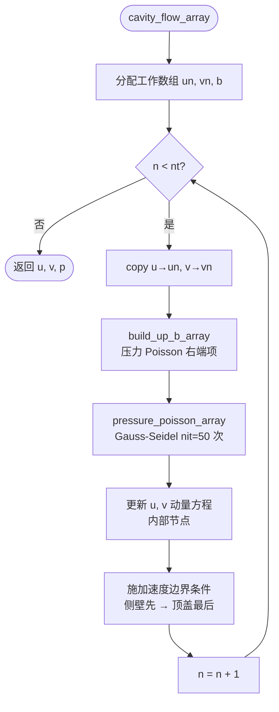
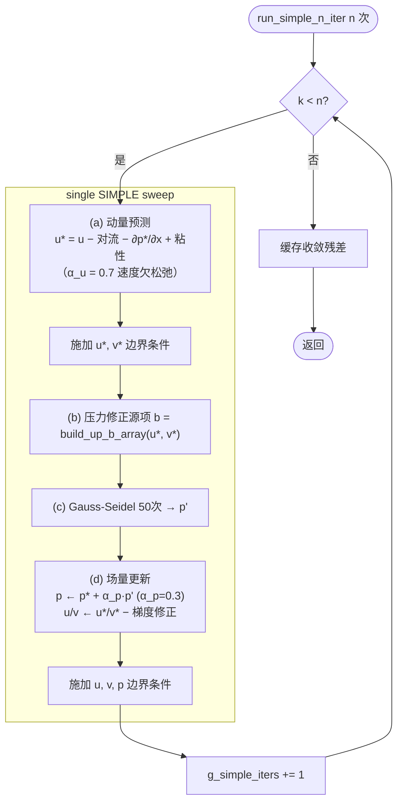
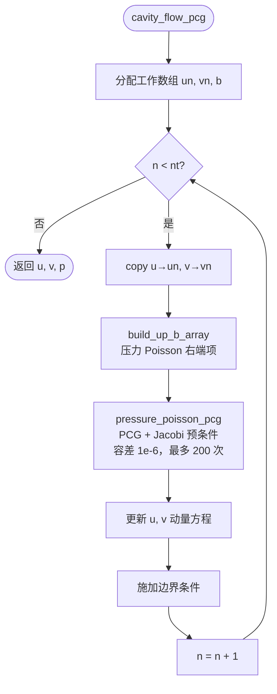
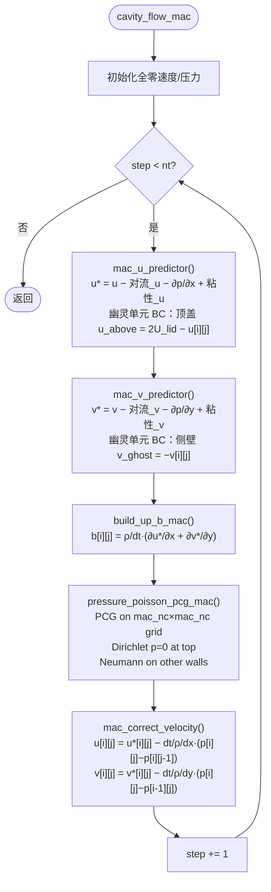

# FlowLabLite — Execution Flow Diagrams

> **更新说明（2026-04-16）：** 新增 Chorin-PCG 和 MAC 交错网格求解器，
> main() 扩展为四求解器串行运行，JSON 输出增加 `pcg_grid` / `mac_grid` 两个字段。

---

## 1. `main()` 函数

```mermaid
flowchart TD
    A([main 入口]) --> B[@bench.monotonic_clock_start\n记录程序启动时间戳]
    B --> C[打印求解器配置\n网格 41×41 / Re=20]

    C --> D{run_chorin?}
    D -- 是 --> E["timed → init_simulation()"]
    D -- 否 --> G
    E --> F["timed → run_n_steps(local_nt)"]
    F --> G{run_simple?}

    G -- 是 --> H["timed → init_simple()"]
    G -- 否 --> J
    H --> I["timed → run_simple_n_iter(local_simple_n)"]
    I --> J{run_pcg?}

    J -- 是 --> K["timed → init_chorin_pcg()"]
    J -- 否 --> M
    K --> L["timed → run_chorin_pcg_n_steps(local_pcg_nt)"]
    L --> M{run_mac?}

    M -- 是 --> N["timed → init_mac()"]
    M -- 否 --> P
    N --> O["timed → run_mac_n_steps(local_mac_nt)"]
    O --> P[@bench.monotonic_clock_end\n计算 total_ms]

    P --> Q{timing_enabled?}
    Q -- 是 --> R[打印 Timing Summary\n各阶段 ms + 总计]
    Q -- 否 --> S
    R --> S["output_json\n四求解器统计 + 网格 → JSON_DATA 块"]
    S --> T([结束])
```

### 本地运行配置常量（`main.mbt` 顶部）

| 常量 | 类型 | 默认值 | 说明 |
|---|---|---|---|
| `timing_enabled` | Bool | true | 计时总开关 |
| `run_chorin` | Bool | true | 是否运行 Chorin |
| `local_nt` | Int | nt=500 | Chorin 步数 |
| `run_simple` | Bool | true | 是否运行 SIMPLE |
| `local_simple_n` | Int | 100 | SIMPLE 迭代次数 |
| `run_pcg` | Bool | true | 是否运行 Chorin-PCG |
| `local_pcg_nt` | Int | nt=500 | PCG 步数 |
| `run_mac` | Bool | true | 是否运行 MAC |
| `local_mac_nt` | Int | nt=500 | MAC 步数 |

---

## 2. `cavity_flow_array()` — Chorin 投影法



---

## 3. SIMPLE 算法 — `simple_one_iter()` / `run_simple_n_iter()`



---

## 4. Chorin-PCG 求解器 — `cavity_flow_pcg()`



### PCG 内层迭代（`pressure_poisson_pcg`）

```mermaid
flowchart TD
    A([PCG 入口\n初始 r = b − Ap]) --> B[Jacobi 预条件\nz = r / a_diag]
    B --> C[ρ = r·z, p_vec = z]
    C --> D{iter < max_iter\n且 |r| > tol?}
    D -- 否 --> Z([返回 p])
    D -- 是 --> E[Ap = laplacian_apply_n(p_vec)]
    E --> F[α = ρ / (p_vec·Ap)\nx += α·p_vec\nr -= α·Ap]
    F --> G[Jacobi 预条件 z = r / a_diag]
    G --> H[ρ_new = r·z\nβ = ρ_new / ρ]
    H --> I[p_vec = z + β·p_vec]
    I --> J[ρ = ρ_new, iter += 1]
    J --> D
```

---

## 5. MAC 交错网格求解器 — `cavity_flow_mac()`



### MAC 网格布局

```
压力 p：mac_nc × mac_nc 单元中心
        ┌─────┬─────┬─────┐
    u→  │  p  │  p  │  p  │  ← u→
        ├─────┼─────┼─────┤
    u→  │  p  │  p  │  p  │  ← u→
        ├─────┼─────┼─────┤
    u→  │  p  │  p  │  p  │  ← u→
        └──↑──┴──↑──┴──↑──┘
           v     v     v

u at x-faces: mac_nc × (mac_nc+1)
v at y-faces: (mac_nc+1) × mac_nc
```

### 散度为零的保证

PCG-内部单元（i=1..mac_nc-2, j=1..mac_nc-2）满足：

$$\text{div}\,\mathbf{u}^{n+1}_{i,j} = \text{div}\,\mathbf{u}^*_{i,j} - \frac{\Delta t}{\rho}\nabla^2 p_{i,j} = \frac{\Delta t}{\rho}\left(b_{i,j} - \nabla^2 p_{i,j}\right) = 0$$

因为 PCG 求解 ∇²p = b，所以内部散度精确为零（至 PCG 容差）。

---

## 6. JSON 输出结构

```
===JSON_DATA_START===
{
  "config": {
    "nx": 41, "ny": 41, "nt": 500,
    "nit": 50, "dt": 0.001, "dx": 0.05, "dy": 0.05,
    "rho": 1.0, "nu": 0.1, "re": 20.0,
    "solver": "all",
    "simple_iters": 100,
    "pcg_steps": 500,
    "pcg_tol": 1e-6, "pcg_max_iter": 200,
    "mac_steps": 500, "mac_nc": 40
  },
  "timing": {
    "enabled": true,
    "chorin_init_ms": ..., "chorin_run_ms": ...,
    "simple_init_ms": ..., "simple_run_ms": ...,
    "pcg_init_ms": ...,    "pcg_run_ms": ...,
    "mac_init_ms": ...,    "mac_run_ms": ...,
    "total_ms": ...
  },
  "statistics":       { max_u, max_v, max_p, min_p, ... },  // Chorin
  "grid":             [ {i,j,x,y,u,v,p,magnitude}, ... ],   // 41×41 = 1681 pts
  "simple_statistics":{ residual, max_u, ... },
  "simple_grid":      [ ... ],   // 1681 pts
  "pcg_statistics":   { max_u, ... },
  "pcg_grid":         [ ... ],   // 1681 pts
  "mac_statistics":   { max_u, ... },
  "mac_grid":         [ ... ]    // 40×40 = 1600 pts (cell centres)
}
===JSON_DATA_END===
```
