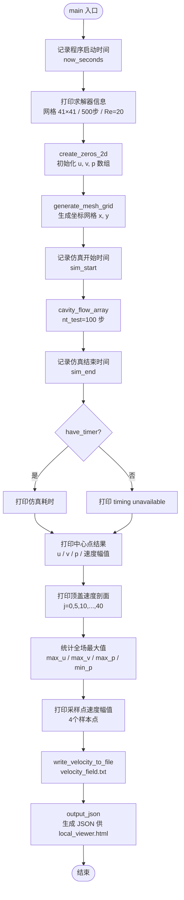
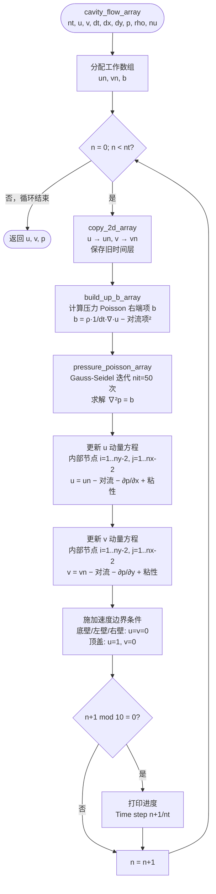
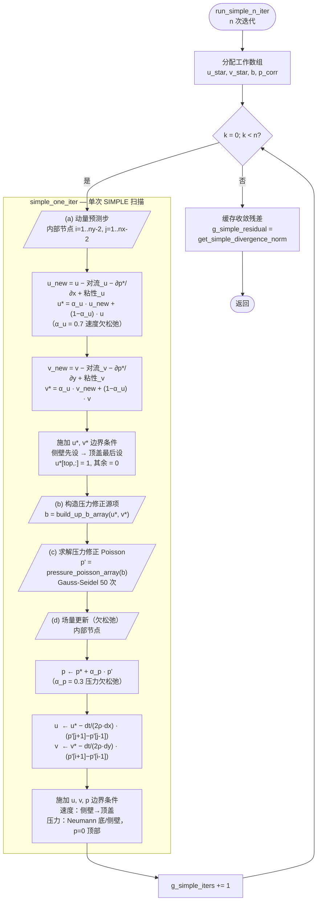

# FlowLabLite — Execution Flow Diagrams

## 1. `main()` Function

---

## 2. `cavity_flow_array()` — Chorin 投影法

> **压力 Poisson 右端项 b（`build_up_b_array`）**
>
> $$b_{i,j} = \rho \left[\frac{1}{\Delta t}\left(\frac{\partial u}{\partial x}+\frac{\partial v}{\partial y}\right) - \left(\frac{\partial u}{\partial x}\right)^2 - 2\frac{\partial u}{\partial y}\frac{\partial v}{\partial x} - \left(\frac{\partial v}{\partial y}\right)^2\right]$$

---

## 3. SIMPLE 算法 — `simple_one_iter()` / `run_simple_n_iter()`

### 欠松弛因子

| 参数 | 值 | 作用 |
|---|---|---|
| `simple_alpha_u` | 0.7 | 速度欠松弛，抑制动量方程振荡 |
| `simple_alpha_p` | 0.3 | 压力欠松弛，稳定压力修正收敛 |

### 收敛判据

$$\text{residual} = \frac{1}{(N_x-2)(N_y-2)} \sum_{i,j} \left|\frac{\partial u}{\partial x} + \frac{\partial v}{\partial y}\right|$$

每批 `run_simple_n_iter(n)` 结束后自动计算并缓存到 `g_simple_residual`，
可通过 `get_simple_residual()` 读取。
